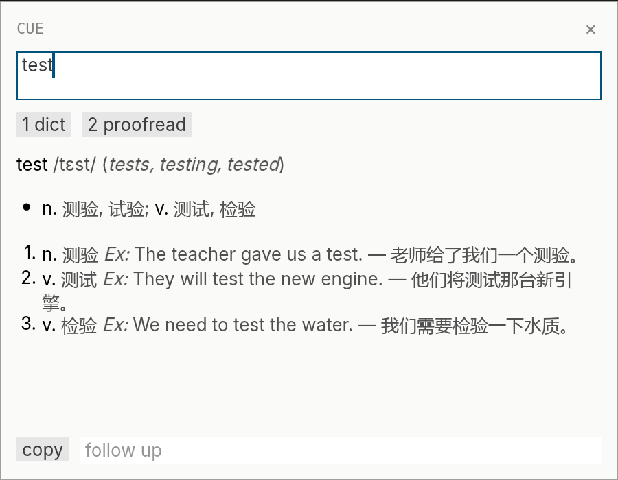

# cue

Select text anywhere and press `Alt+Q`. A small flat window streams the answer.

One hotkey. Custom actions, each with its own prompt, model, and reasoning toggle, on any OpenAI-compatible API. Tray icon with GUI settings. Config lives in `settings.toml`; keys stay in `%APPDATA%\cue\secrets.toml`. Follow-up chat, WebDAV config backup, start at login. A single 6 MB exe with no runtime.

Use: download `cue.exe` from Releases, run it, set your API key in the tray settings.

Build: `./build.ps1`, with the Rust windows-gnu toolchain and [w64devkit](https://github.com/skeeto/w64devkit) on PATH.

## 中文

在任意位置选中文本，按 `Alt+Q`，极简小窗流式输出回答。

一个热键。自定义动作，每个动作有独立的提示词、模型和推理开关，兼容任意 OpenAI 格式的 API。托盘图标与图形设置。配置存于 `settings.toml`，密钥存于 `%APPDATA%\cue\secrets.toml`。支持追问、WebDAV 配置备份、开机自启。单文件 6 MB，无运行时依赖。

使用：从 Releases 下载 `cue.exe`，运行后在托盘设置中填入 API 密钥。

构建：运行 `./build.ps1`，需要 Rust windows-gnu 工具链，并将 [w64devkit](https://github.com/skeeto/w64devkit) 加入 PATH。
